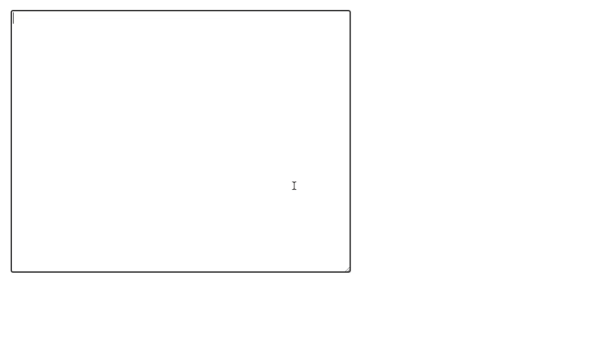
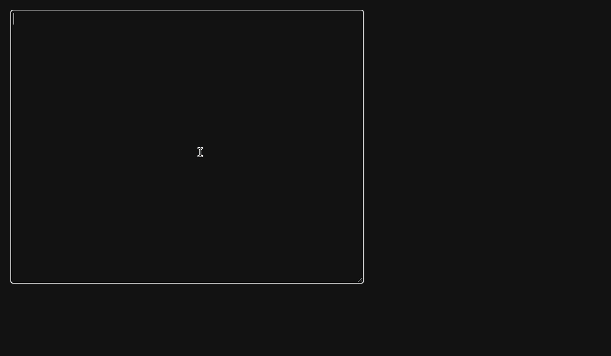

# Ranzlit

Simple React app for transliteration from Latin to Russian Cyrillic.

## Why?

There are multiple services readily available that transliterate from Latin to various non-Latin alphabets (e.g., https://translit.cc or https://translit.ru ).
However, all I really want is a simple input area to type in, without ads or config options for other Cyrillic alphabets.

This is how ranzlit looks:



Dark mode via `prefers-color-scheme`:



Transliteration is performed on the textarea following the `transliterationMap` specified in [Translit.tsx](./src/Translit.tsx).

## Building

```
nix build --print-build-logs .#ranzlit
```

## Developing and testing

Either use `direnv allow` or `nix develop` to drop into a development environment.
Then run `npm start` to build with automatic rebuilds on change or `npm test` to
run the tests.

## LICENSE

This project is released under the terms of the MIT License. See [LICENSE](./LICENSE).
